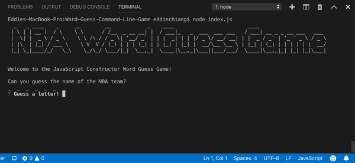

# Word-Guess-Command-Line-Game
Advanced JavaScript Constructor Word Guess Game Using Command Line Interface

## Overview
This is a command line interface Word Guess Game designed with constructor functions.  Play and guess the names of your favorite NBA teams! :basketball:

## How to Run the Game:
1. Clone down repository.
2. Navigate to the root of your project and run `npm install` to install the required versions of third party npm packages as instructed in the `package.json` file.
3. Run command `node index.js` and follow the prompt to play the game.

## Built with:
* JavaScript
* Node.js
* Node Package Manager (npm)

## npm packages: 
* [Inquirer.js](https://www.npmjs.com/package/inquirer) - A collection of common interactive command line user interfaces to provide inquiry session flow. :question: :speech_balloon:
* [Figlet](https://www.npmjs.com/package/figlet) - Create ASCII text banners from plain text, using command-line utilities to fully implement the FIGfont spec in JavaScript. :pencil: :computer:
* [Colors.js](https://www.npmjs.com/package/colors) - Get colors for the ANSI terminal text in your node.js console. :rainbow:

## Author
* Eddie Chiang
* Click on the GitHub link!
https://github.com/echiang73/Word-Guess-Command-Line-Game

## Here is the preview of the node application:

